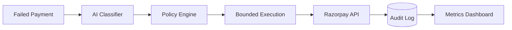

# 🔄 RazorRecover — AI-Powered Failed Payment Recovery Agent

> **Razorpay AI Buildathon 2026** · Track 3: AI Revenue Recovery

## Problem
Merchants lose significant revenue when customer payments fail. Most of this lost revenue is recoverable if the failure reason is correctly identified and the right intervention is applied quickly.

## Solution
RazorRecover automates failed payment recovery using:
- **AI Classification**: Claude classifies payment failure reasons from transaction metadata
- **Deterministic Policy Engine**: Rule-based, auditable decision-making — the AI never directly triggers payment actions
- **Bounded Execution**: Retries via Razorpay test API with backoff and hard limits
- **Immutable Audit Trail**: Every action logged for complete traceability
- **Recovery Metrics**: Real-time dashboard showing revenue recovered

## Architecture


## Key Design Principle
> Every money-related action is explainable, bounded, and gated. The LLM classifies — it never decides to move money.

## Tech Stack
| Component | Technology |
| :--- | :--- |
| **Backend** | Python 3.13, FastAPI |
| **Database** | PostgreSQL / Supabase |
| **Cache** | Redis / Upstash |
| **AI** | Anthropic Claude |
| **Payments** | Razorpay SDK (Test Mode) |
| **Dashboard**| Streamlit |

## Quick Start
```bash
# 1. Clone repo
git clone https://github.com/your-username/razorrecover.git
cd razorrecover

# 2. Setup environment variables
cp .env.example .env

# 3. Start backing services (PostgreSQL & Redis)
docker-compose up -d

# 4. Install dependencies
pip install -r requirements.txt

# 5. Initialize the database schema
python scripts/init_db.py

# 6. Generate synthetic data for testing
python scripts/generate_synthetic_data.py

# 7. Start the FastAPI server
uvicorn app.main:app --reload
```

## Project Structure
```text
razorrecover/
├── app/
│   ├── api/          # API endpoints
│   ├── core/         # Configuration, security
│   ├── models/       # SQLAlchemy models
│   ├── schemas/      # Pydantic schemas
│   ├── services/     # Business logic
│   └── main.py       # FastAPI application
├── scripts/          # DB init and setup scripts
├── tests/            # Pytest test suite
├── .env.example      # Example environment variables
├── docker-compose.yml# Docker services (Postgres, Redis)
├── requirements.txt  # Python dependencies
└── README.md         # Project documentation
```

## API Endpoints
| Method | Endpoint | Description |
| :--- | :--- | :--- |
| `GET` | `/api/v1/health` | Coming in Phase 2+ |
| `POST` | `/api/v1/payments/webhook` | Coming in Phase 2+ |
| `GET` | `/api/v1/recovery/metrics` | Coming in Phase 2+ |

## Development Phases
- [x] Phase 1: Database Schema & Project Scaffolding
- [ ] Phase 2: CRUD Operations
- [ ] Phase 3: AI Classification Engine
- [ ] Phase 4: Policy Engine
- [ ] Phase 5: Razorpay Integration
- [ ] Phase 6: Metrics & Dashboard
- [ ] Phase 7: Failure Injection Testing

## License
MIT
